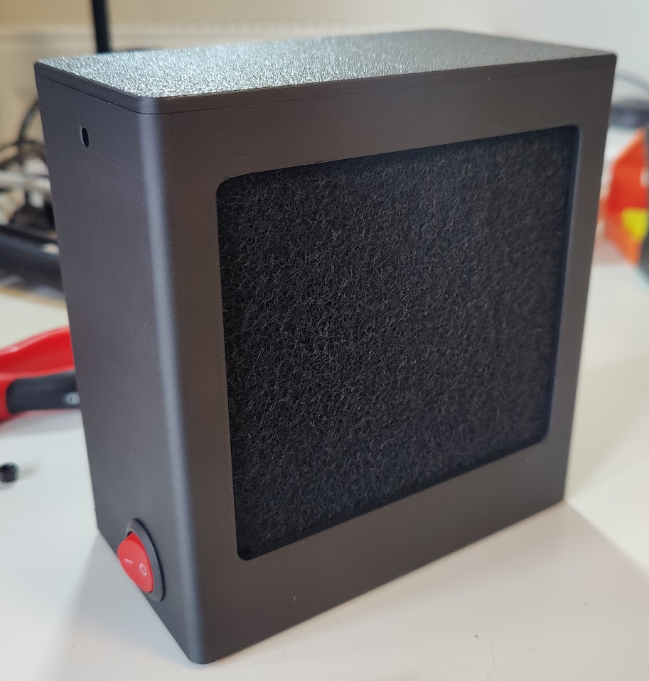

# Fume Extractor

This repository contains the files and BOM for a 3D printed fume extractor that I designed. The
purpose of the extractor is to help filter harmful fumes when soldering. You can read more about how
and why I designed and built this [here](https://hancic.info/fume-extractor).

This is how it looks when fully assembled:

## Specification

* Dimension: 136x75x143mm (including feet).
* Power: 9V battery
* Filter: activated carbon
* Fan: 120mm PC fan

## How to build your own

### 3D files

The extractor was designed with Onshape.

* [STEP file](fume-extractor.step)
* [STL - box](box.stl)
* [STL - lid](lid.stl)
* [STL - gasket](gasket.stl)
* [STL - foot](foot.stl)
* [Onshape document](https://cad.onshape.com/documents/d140111f72cf1d4d67295af1/w/85f2bb20df2b3504e346a7eb/e/540b4dcc5df4f8a55d2cacdb?renderMode=0&uiState=68054b7ff55ce704c9a35252) (free registration required)

### Bill of Materials

* 3D printed parts from files listed above.
* Noctua NF-P12 redux-1700 PWM or any other 120mm PC fan.
* 9V Battery Clip Connector.
* 9V Battery.
* [Red Round Rocker Switch](https://www.amazon.co.uk/dp/B0DHWWQL99).
* 2x 115x105mm activated carbon filter (e.g. [like this](https://www.amazon.co.uk/dp/B0D7PBTY8M)).
* 4x M4 nuts & bolts (at least 35mm).

### How to print

I used a BambuLab P1S and printed the box and lid with [BambuLab PLA Matte](https://uk.store.bambulab.com/products/pla-matte?id=40215560978492).
For the gasket and feet I used [Tinmorry TPU](https://tinmorry.net/en-gb/products/tinmorry-filament-tpu-1-75-mm-tpu-filament-3d-printing-materials-for-3d-printer-1-kg-1-spool-yellow-%E5%A4%8D%E5%88%B6).

For settings I simply used the defaults but I think you can adjust these to your liking as it is
fairly easy print.

## Potential future improvements

* Use 12V battery or switch to wired power supply.
* Make it taller.
* Add shadow line between lid and box.
* (maybe) split box into two vertically to allow printing both holes flat.

## License

[MIT](LICENSE)
